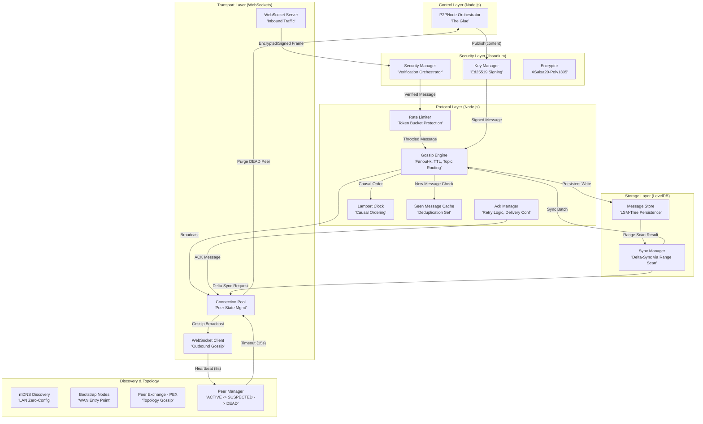

# System Architecture Blueprint: P2P Gossip Mesh

This document provides a mechanical-style blueprint of the system architecture, mapping every logical component to its actual implementation in the codebase.

## 📐 High-Level Block Diagram

## 🛠️ Layered Component Breakdown

### 1. Transport Layer (WebSockets)
- **Technology**: `ws` library (Node.js).
- **Purpose**: Low-latency, full-duplex communication over unstable networks.
- **Components**: 
    - `ConnectionPool`: The central registry for all active peer sockets.
    - `WSServer`: Listens for incoming connections and initiates the HELLO handshake.
    - `WSClient`: Handles outbound connections with exponential backoff.

### 2. Security Layer (libsodium)
- **Technology**: `sodium-native`.
- **Purpose**: Authenticated encryption and non-repudiation.
- **Components**:
    - `SecurityManager`: Validates message signatures before they reach the protocol layer.
    - `KeyManager`: Manages Ed25519 (Signing) and X25519 (Encryption) keys.

### 3. Protocol Layer (Node.js)
- **Technology**: Custom Event-Driven Logic.
- **Purpose**: Distributed consensus and propagation rules.
- **Components**:
    - `GossipEngine`: Implements epidemic fanout-k propagation.
    - `LamportClock`: Ensures causal ordering without a global clock.
    - `RateLimiter`: Token bucket implementation to prevent spam.

### 4. Storage Layer (LevelDB)
- **Technology**: `level` (LSM-tree).
- **Purpose**: Persistence and efficient delta-synchronization.
- **Components**:
    - `MessageStore`: Handles structured indexing for fast retrieval.
    - `SyncManager`: Resolves network partitions via timestamped range scans.

---
*Created by: Rishi192004*
*Verified by VibeCheck ✅*
